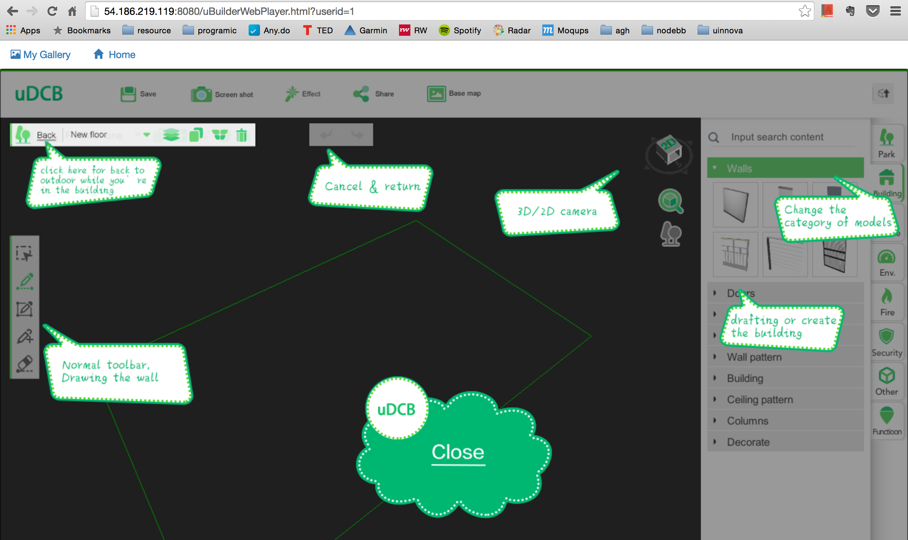

# 流水帐

this week i am working on dynamic part of english website, put all thing together and make end to end process ready.

## end to end ready [uinnova_en site](http://54.186.219.119:8080)
1. user **Register** as an number   
2. **Build Online**

3. **Save** my creation to backend database, with image upload to aws s3
4. view ones creation in my **Gallery** 

5. **Edit** saved entry
6. *Export* to local disk
7. **Import** into uDCV, import asset/wired data with cabinet
8. **Social** functions including leave comments and suggestions, share creation, browse and download documentations, tutorial and trail versions

*[TODO]* 
- delete entry in my Gallery
- still some traslation in uDCB and uDCV need to adjust
- follow up uDCB standalone version
- bug fix on heatmap function in uDCV 
- wording, images and links in website