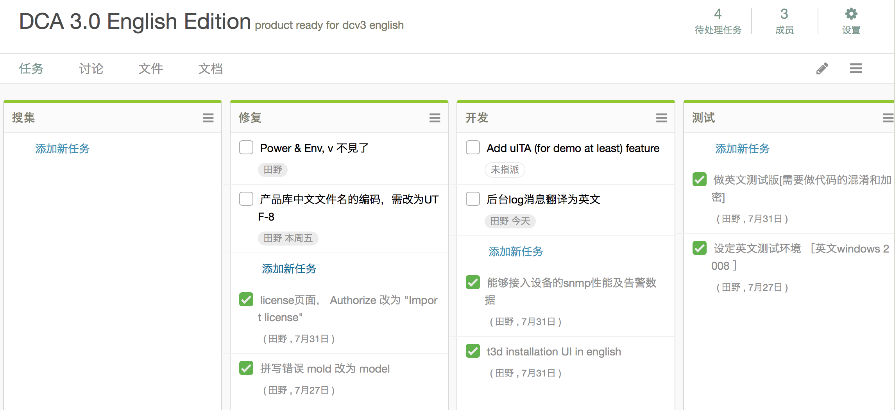

## 流水帐
- **Monday**, on board, fill *lots* of forms, chat with Donny, Aohan, yangchao about dcv en version and other plans. make key days for DCV english version [see details below].
- **Tuesday**
  1. request and  granted to ITA git repository, clone to local[for for lizhong's help]
  2. upgrade corp PC to windows 10
  3. request and granted access to dcv svn repository
  4. setup eclipse 10 and import dcv en project, running okey via eclipse plugin [thanks for 田野's help]
  5. translate key words (about 100 words) from model json, according to 大师兄
  6. *injured* in field while playing soccer.
  7. submit expense about corp PC.
  8. visit mingshen datacenter in shunyi with yangchao, aohan and kongfeng.
- **Wednesday**
  1. take sick leave
  2. phone chat with 田野 with dcv english version strategy. [see details below]
  3. adjust the model translation: key words are used for indexing, so there are better no space between words. for instance, 'air conditionor' should become 'AC'.

- **Thursday**
  1. do an extended search on css templates for new english website, get an copy of [this](http://demo.cssmoban.com/cssthemes3/mbts_24_Cubic/index.html), looks promising.
  2. start to reading source code of ITA, some initial notes is [here](http://mt5225.gitbooks.io/ita-sourcecode-reading/content/index.html)
  3. Advised from my doctor i should lay down still on bed, *reduce workload*.
- **Friday**
  1. conf call with Donny, go through the data import steps in DCV. 

## DCV English key dates
discussed in conference room with Donny, Yangchao, Aohan, mark some key days as following： 
- [week of Aug 03] make sure model and pool.config can work with DCV english version.
- [Aug 14] installation guide, quickstart guide, demo script -- Jerry Demo script -- Donny
- [End of Aug] dcb website redesign -- Donny/Jerry

## Version Strategy
- due to *urgent* [**every request is urgent, but some request is more urgent than others**] need of English version, i suggest to maintain Engish version in an separate svn repository, as well as tracing bugs and RFEs individually. 
- create tasks according to above thoughts in tower and assigned to 田野.

## Misc
1. befor get access to corp jira, leverage [tower](http://towner.im) as task tracing platform, add Donny and 田野 to participates.

