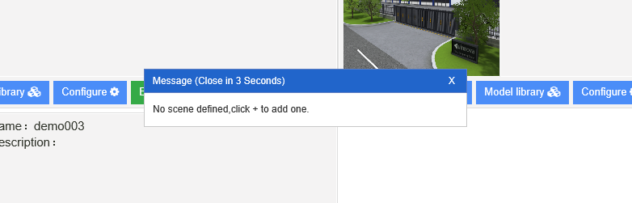

#流水帐
## uinnova.com website adjustment
- layout, video format and color adjustment
- about video format, i found a handy command line tool to convert .mp4 to .webm, while user can control *quality* of output by argument. for instance, you can set 4M/s rate output as following:
```
ffmpeg -i en_web_videobg.mp4 -c:v libvpx -b:v 4M -c:a libvorbis en_web_videobg.webm
```

## uDCV en version translation continues/bug fix
- 'user preference' UI translation, a bunch of UI translation does no *work* in Donny and my pc, work with 田野 to fix the issue. expected fix day: early next week.
- work around for heatmap data generator:  **all sensor in uDCB should start with WSD as their ID/title**

## uDCB en standalone sanity check
- 李鉴 have shipped an standalone version late this week. Sanity check result: the exported json file fail to create scene in uDCV.

