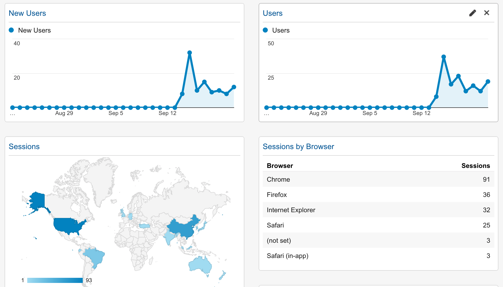
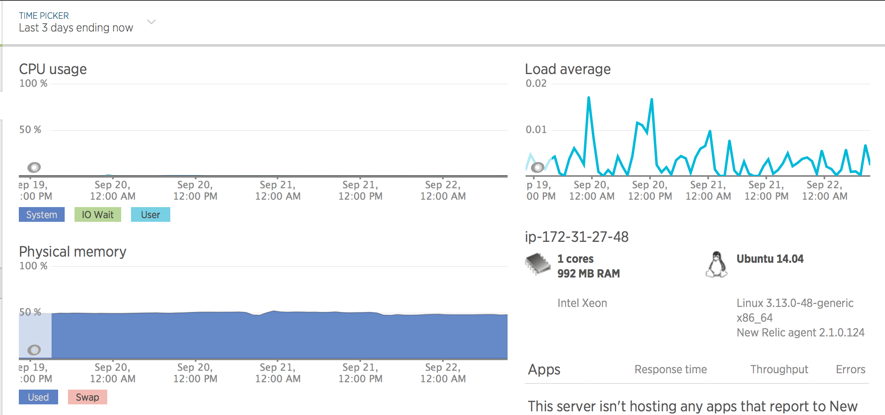
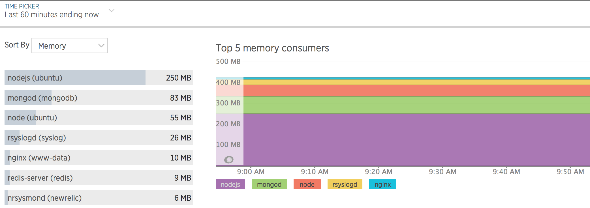
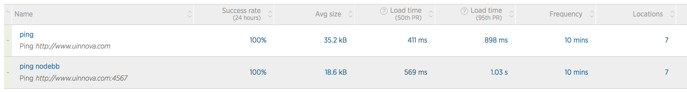

#流水帐
##new en website online matrix
1. point uinnova.com DNS to new website, then the old content is offline.
2. apply Google webmaster/analytic , below is the snapshot of website traffic:

3. apply newlic website monitoring
 - server matrix

 - top processes

[note] the memory usage is about <red>50%</red> due to low configuration of aws instance (1C1G), will upgrade if usage is up about 70%

 - url matrix/synthetics monitoring
from 7 locations, 100% avail

 - request breakdown
